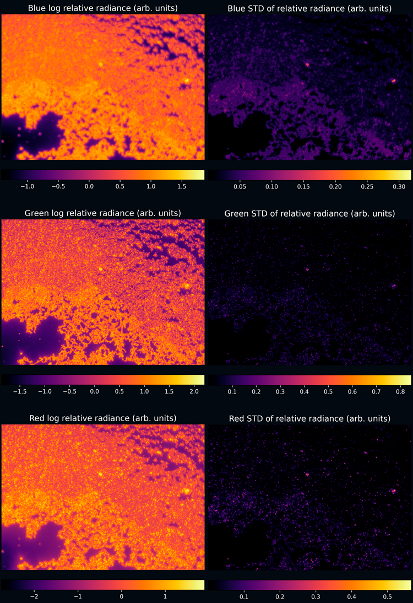

# clair-torch

`clair-torch` (**C**amera **L**inearity **A**nd **I**rradiance **R**egistration) is an open-source Python package
mainly built on PyTorch. The main functionalities of this package are the quantitatively well-defined and 
uncertainty propagation including

- analysis of the linearity of a camera and images captured on it,
- solving the inverse camera response function,
- linearization of single images,
- HDR merging of a series of images captured at varying exposure times.

The main theoretical basis is that for a static scene, increasing the  exposure time linearly should result in linearly
increasing pixel values in the captured images. Discounting noise, any deviations from this should be the result of a
nonlinear mapping from the raw voltage values to the final pixel values. This mapping is known as the camera
response function (CRF) or opto-electronic transfer function (OETF). By solving the inverse camera response function
(ICRF), one can then reverse this nonlinearity upto a relatively high degree.

This enables tying the pixel values in an HDR merged image to actual irradiance in relative units. This package does not
deal with the conversion to absolute irradiance units, with the relative units typically being sufficient in most situations.
In figure 1. is a series of images captured at increasing exposure times.

<figure style="text-align: center;">
    
    <figcaption>Figure 1. Series of images captured at increasing exposure times under static conditions. Bottom-right shows an uncertainty image associated with the 50.03 ms image.</figcaption>
</figure>

With sufficiently good conditions and a solved ICRF, the series can be merged into a single HDR image that is a quite
quantitatively accurate measurement of the irradiance the camera sensor receives at each pixel site. The merged result
is visualized in figure 2. by splitting the RGB color channels into separate images and taking the logarithm of the values. This
shows the wide scale or relative irradiance values that the sensor has received, highlighting the value of an HDR image
in certain situations.

<figure style="text-align: center;">
    
    <figcaption>Figure 2. False color visualization of the logarithm HDR image merged from the series in figure 1. The left-hand side shows the radiance values, while the right-hand side show the uncertainty of these values.</figcaption>
</figure>

## License

`clair-torch` depends on a number of third-party packages. These packages are not distributed as a part of this
repository and are only listed as dependencies in the `pipfile`. This package itself is licensed under the MIT License.

## Installation

`clair-torch` is currently work-in-progress, and thus available only through this GitHub repository. In time,
when a version 1.0.0 is ready, my aim is to make the package available on PyPi for install via `pip`.

Currently, the `pipfile` pins the CUDA version for my own development purposes, but eventually this will be modified to
let users set their own version as needed.

## Project structure

This project is split into multiple directories with different purposes as follows.

1. `clair_torch` is the main package, which contains also the various subpackages.
2. `dev_tools` contains developer tools not needed for run-time functionality.
3. `docs` contains the markdown files used by mkdocs to generate documentation.
4. `scripts` will later contain some sample scripts that can be used to run certain operations via a commandline interface. Their
main purpose is to act as a simple reference on how to use `clair_torch`. (WIP)
5. `site` contains the assets generated by mkdocs for the documentation webpage.
6. `tests` contains all the tests for the whole project, divided into unit tests, end-to-end tests (WIP) per subpackage.

## Usage

The `scripts/` directory will eventually contain multiple examples of ready to run scripts for some common use cases. The main building
blocks for making your own scripts are the different subclasses of `BaseFileSettings`. These handle the IO part of the
workflow and are utilized within the dataset subclasses of `MultiFileMapDataset`, which implements the PyTorch Dataset
class. These dataset classes are in turn utilized with the PyTorch Dataloader class along with a custom collate function
for handling the loading and batching of input data.

The documentation pages will also in time contain examples on how to use the package, but for now no examples of usage are
finished.

## Work in progress

This package is a work-in-progress project for the time being, with minor missing functionality and tests, but chiefly a
stable public API. This project  is a full rewrite of my earlier project `camera_linearity` found at
https://github.com/samivout/camera_linearity, which is left as an archived repository.
Following me starting to become familiar with PyTorch, I wanted to approach its usage through a familiar domain,
leveraging the autograd system, easy handling of both CPU and GPU usage and the training/optimization environment.
